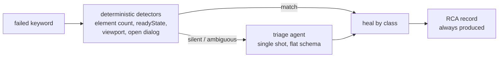

# Failure taxonomy and triage

heal reframes a test failure as a **classification problem**, not a locator-repair
problem. Every failed keyword belongs to one of seven [failure classes](../reference/failure-classes.md),
and each class has its own evidence, healing action, and "give up gracefully" output.

## Deterministic first, LLM only when needed

Classification is tiered for cost and reliability:

The cheap majority of failures are classified with **no LLM call at all** — a
locator that matches zero elements is `locator-drift`, a non-ready document is
`timing`. The triage agent runs only when detectors are silent, and it returns a
flat `{failure_class, confidence, rationale}` so even small prompted-JSON models
can produce it.

## Verification in the loop

heal never trusts a proposal. Every healing action is verified against the live
session before it is accepted — a proposed locator must exist, be unique, be
visible, be type-compatible with the keyword, and not be a container. This
verification lives in **output validators**, so it works in every model output
mode (it does not depend on tool calling). A rejected proposal is fed back to the
model as a retry with the specific reason, so it corrects itself.

!!! warning "Verified ≠ correct"
    Verification catches *invalid* proposals, not *plausible-but-wrong* ones. A
    locator that uniquely matches the wrong field passes every live check. That is
    why heal keeps an LLM judgment in the loop even on cheap deterministic tiers,
    and why the [root-cause record](rca-and-fixes.md) makes every heal reviewable.

## Why RCA is always produced

Healing can be disabled, budgeted out, or simply impossible. The **root-cause
record is the universal product**: a clean, enriched error for every failure,
healed or not. A tool that only heals is fragile; a tool that always explains
earns its keep even when it can't fix.
