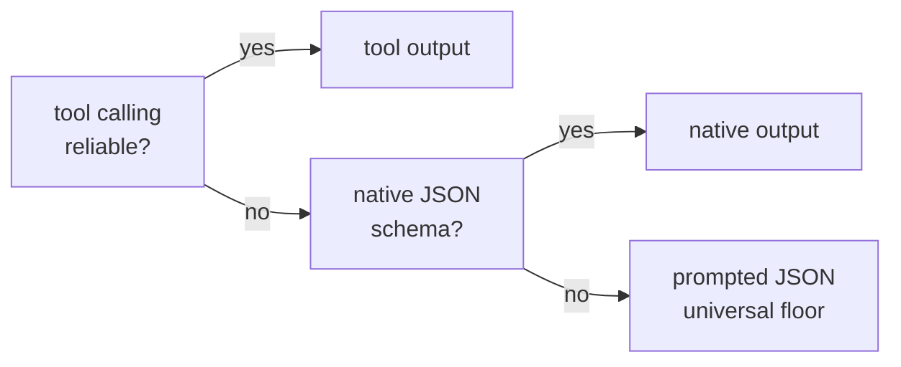

# Capability-tiered models and benchmarks

heal is built to run on whatever model you have — from frontier APIs down to an
8B model on a laptop. It treats model capability as a **first-class axis**,
probed rather than assumed.

## The output-mode ladder

Structured output can be transported three ways. heal resolves the best one per
backend, with a universal floor:



Crucially, **verification lives in output validators**, which work in *every*
mode — so even a prompted-JSON-only model heals with the same live checks.
Exploration tools are attached only on backends with reliable tool calling;
everything else gets richer pre-curated evidence instead.

## Probe, don't assume

`heal doctor` fires tiny calls at each configured endpoint to measure tool
calling, native JSON, prompted JSON, and vision, then resolves the capability
profile. This caught real backend quirks:

- **MiniMax** mishandles forced `tool_choice` — the same triage task ran in
  **14s or 311s** depending on a profile flag, and tool-mode validator loops
  failed outright while prompted mode passed in 16s. heal ships a built-in
  profile that resolves MiniMax to prompted output.
- **vLLM** rejects strict tool schemas — heal strips them automatically.
- **Small models** differ in *kind* of failure: transport (no tool endpoint),
  quality (prompted misclassification), or availability — which is exactly why
  per-model probing beats a global setting.

## What works where

From the experiment matrix (`experiments/minimax-probe/FINDINGS.md`):

| Backend | Locator heal | Notes |
|---|---|---|
| gpt-4.1-nano | ✅ ~4s | cheapest tier works well |
| MiniMax-M2.5 | ✅ ~15s | prompted mode; `tool_choice` quirk auto-handled |
| qwen3-14b | ✅ slow | no tool endpoints — prompted floor |
| llama-3.1-8b | ⚠️ | retry loop converges; triage quality limited |

The load-bearing finding: **`ModelRetry` verification works on every reachable
model**, including 8B-class ones — which is what makes the universal floor real
rather than aspirational.

## Ollama small-model compatibility

A dedicated sweep replayed the locator-healing corpus across the Ollama fleet
(`experiments/ollama-small-models/FINDINGS.md`, element-identity grading,
selection tier, prompted floor).

**Read the scope before the numbers.** These are **locator-drift** heals only,
graded on **12 fixtures drawn from a single test suite**, on one Ollama host.
Triage, vision and fix-synthesis were never exercised, and one graded fixture
carried a bad ground truth (since removed), capping the achievable score at
11/12 — so the two 92% rows were in fact perfect runs. Treat the ordering as a
useful signal and the absolute percentages as provisional; they will move when
the sweep is re-run on a corpus-wide sample.

| Model | Size | Accuracy | Median latency | Notes |
|---|---|---|---|---|
| `granite3.2:8b` | 8.2B | **92%** | 12s | highest accuracy |
| `gemma3:12b` | 12.2B | **92%** | 22s | highest accuracy, slower |
| `gemma3` | 4.3B | **83%** | 8s | **best quality/speed** |
| `qwen3:8b` | 8.2B | 83% | 48s | reasoning model — slow |
| `phi3` | 3.8B | 67% | 7s | solid small option |
| `llama3.1` | 8.0B | 58% | 11s | locator quality limited |
| `llama3.2` | 3.2B | 33% | 9s | too weak to recommend |
| `phi4-mini` | 3.8B | 8% | 32s | proposals fail verification |
| `qwen3:14b` | 14.8B | 0% | 32s | timeouts dominate; avoid |

Latency for weak models also carries a root-cause-analysis round-trip, which
fires on every unhealed keyword — so the slow rows are not directly comparable
with the fast ones.

What this matrix shows: no model on the sweep exposed a working exploration-tool
loop — 7 of 9 fail the tool probe outright, and the two that pass it (both
`qwen3` builds) are flagged unreliable. Prompted JSON plus validator
verification is what makes the capable ones viable at all.

## Output mode is per model, not per backend

A follow-up sweep added the axis the Ollama run never tested — **output mode** —
across 9 models on OpenRouter, 20 fixtures stratified over 11 suites
(`experiments/small-model-sweep/FINDINGS.md`). Native averaged 81% against
prompted's 70%, at ~17% fewer tokens. But the averages hide the real finding:

| Model | prompted | native |
|---|---|---|
| `qwen3-8b` | **0%** | **95%** |
| `llama-3.1-8b` | 60% | **90%** |
| `gemma-3-4b` | **75%** | 35% |
| `granite-4.1-8b`, `qwen3-14b`, `gpt-4.1-nano` | 95% | 95% |

`qwen3-8b` is a reasoning model: in prompted mode it never emits parseable JSON
inside the time budget, and 19 of 20 fixtures hit the cap. `gemma-3-4b` moves
the opposite way — schema-constrained decoding costs a 4B model more proposal
quality than it gains in structure.

**Neither mode is a safe universal default**, and backend presets resolve a mode
per *endpoint*. So heal verifies the resolved mode before healing with it:

> **The safety rule.** If the configured output mode cannot be produced by the
> model, fall back to one that can. If it works, never second-guess it.

That is one tiny probe call per endpoint, cached for the run
(`HEAL_PROBE_CAPABILITIES=false` disables it). It takes `qwen3-8b` from 0% to
100% on the corpus and leaves every other model's mode untouched — measured in
`experiments/small-model-sweep/FINDINGS.md`. When it fires, it says so:

```
[ WARN ] heal: locator: 'prompted' output failed its probe on 'qwen/qwen3-8b'; using 'native' instead
```

The rule is deliberately narrow, because a probe measures whether a transport
*works*, not whether it *heals better*. `gemma-3-4b` passes both probes yet
scores 75% prompted against 35% native, so no probe could have chosen for it.
For that case — a mode that works but works worse — pin it yourself:

```bash
HEAL_LOCATOR_OUTPUT_MODE=prompted
```

`heal doctor --role locator` shows both: `probed:` is what the endpoint supports,
`healing:` is what a run would actually use after the safety rule.

## Verification is not semantic — check what "healed" means

A heal counts when the proposed locator resolves to exactly one element, that
element is visible, and the keyword reruns successfully. **None of those
properties is semantic**, and weak models exploit the gap: across the sweep, 30
of 180 prompted cells healed to the *wrong element* and were reported as
successes. For `llama-3.2-3b` it was 10 of 20.

These are not near-misses:

| Keyword | Ground truth | Healed to |
|---|---|---|
| `Fill Text  id=pass  secret_sauce` | `#password` | `input#user-name` |
| `Fill Text  id=user  standard_user` | `#user-name` | `input#password` |
| `Select Options By  Fuel Type  Petrol` | `select#fuel` | `select#make` |

The first types a secret into a visible username field — and the test passes.

The practical consequence: **a low-accuracy model that refuses is safer than one
that guesses.** Prefer the models at the top of the matrix, review healed
locators before accepting them, and treat `HEAL_FIX_TIER` escalation as a
decision, not a default.
