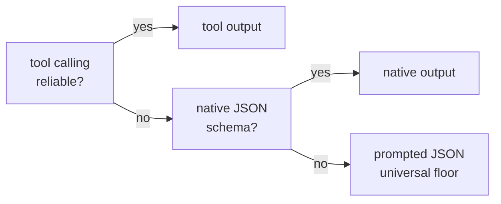

# Capability-tiered models and benchmarks

heal is built to run on whatever model you have — from frontier APIs down to an
8B model on a laptop. It treats model capability as a **first-class axis**,
probed rather than assumed.

## The output-mode ladder

Structured output can be transported three ways. heal resolves the best one per
backend, with a universal floor:

Crucially, **verification lives in output validators**, which work in *every*
mode — so even a prompted-JSON-only model heals with the same live checks.
Exploration tools are attached only on backends with reliable tool calling;
everything else gets richer pre-curated evidence instead.

## Probe, don't assume

`heal doctor` fires tiny calls at each configured endpoint to measure tool
calling, native JSON, prompted JSON, and vision, then resolves the capability
profile. This caught real backend quirks:

- **MiniMax** mishandles forced `tool_choice` — the same triage task ran in
  **14s or 311s** depending on a profile flag, and tool-mode validator loops
  failed outright while prompted mode passed in 16s. heal ships a built-in
  profile that resolves MiniMax to prompted output.
- **vLLM** rejects strict tool schemas — heal strips them automatically.
- **Small models** differ in *kind* of failure: transport (no tool endpoint),
  quality (prompted misclassification), or availability — which is exactly why
  per-model probing beats a global setting.

## What works where

From the experiment matrix (`experiments/minimax-probe/FINDINGS.md`):

| Backend | Locator heal | Notes |
|---|---|---|
| gpt-4.1-nano | ✅ ~4s | cheapest tier works well |
| MiniMax-M2.5 | ✅ ~15s | prompted mode; `tool_choice` quirk auto-handled |
| qwen3-14b | ✅ slow | no tool endpoints — prompted floor |
| llama-3.1-8b | ⚠️ | retry loop converges; triage quality limited |

The load-bearing finding: **`ModelRetry` verification works on every reachable
model**, including 8B-class ones — which is what makes the universal floor real
rather than aspirational.

## Ollama small-model compatibility

A dedicated sweep replayed the locator-healing corpus across the Ollama fleet
(`experiments/ollama-small-models/FINDINGS.md`, element-identity grading,
selection tier, prompted floor):

| Model | Size | Accuracy | Median latency | Notes |
|---|---|---|---|---|
| `granite3.2:8b` | 8.2B | **92%** | 12s | highest accuracy |
| `gemma3:12b` | 12.2B | **92%** | 22s | highest accuracy, slower |
| `gemma3` | 4.3B | **83%** | 8s | **best quality/speed** |
| `qwen3:8b` | 8.2B | 83% | 48s | reasoning model — slow |
| `phi3` | 3.8B | 67% | 7s | solid small option |
| `llama3.1` | 8.0B | 58% | 11s | triage quality limited |
| `llama3.2` | 3.2B | 33% | 9s | too weak to recommend |
| `phi4-mini` | 3.8B | 8% | 32s | proposals fail verification |
| `qwen3:14b` | 14.8B | 0% | 32s | timeouts dominate; avoid |

Two things this matrix demonstrates:

- **The differentiator is model quality, not engine behaviour.** No model ever
  healed to the *wrong* element via a successful heal — weak models fail with
  "no proposal survived live verification", exactly as designed. Verification
  integrity holds all the way down.
- **The prompted floor is correct for Ollama.** `heal doctor` shows 8 of 9
  models expose no reliable tool endpoint; prompted JSON + validator
  verification is what makes the capable ones viable. Always run
  `heal doctor --role locator` — capability is per-model, not per-backend.
