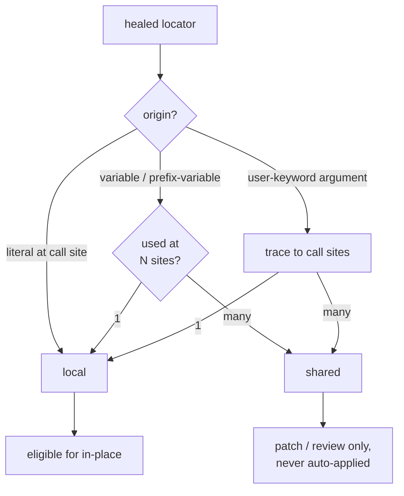

# Root-cause analysis and fixes

## Every failure gets a record

Healed, unhealed, or suppressed, every transaction produces a typed `RcaRecord`:
a clean human-readable message, the root cause, the evidence collected, the
actions attempted, and a suggested permanent fix. For unhealable failures, an RCA
agent enriches the message — turning a raw `TimeoutError` stack into "the login
button id changed from `login-button` to `signin-btn`."

### Test-change context

When the test source is in a git repository, heal collects the failing line's
last-modified date and recent history. That lets the RCA distinguish
**"test outdated"** (the locator's line last changed 14 months ago; the app moved
on) from **"application changed"** or **"application defect"** — a causality hint
no single-run view can give.

## Fix blast radius

A heal can become a permanent code change, but *where* the change lands decides
how dangerous it is. The fix engine resolves the locator's origin through the RF
parsing model and classifies the blast radius:

A locator stored in a `${VARIABLE}` used by 14 keywords is **`shared`** — heal
will *never* auto-edit it in place, because that would change 14 call sites at
once. Instead it produces a patch and lists every usage so you (or a
[coding agent](../how-to/mcp-coding-agents.md)) can decide. A literal at a single
call site is `local` and safe to apply.

This is the difference between a trustworthy autofixer and one that breaks the
other 13 tests. See [Fix test files](../how-to/fixing-files.md) for the
application tiers.
