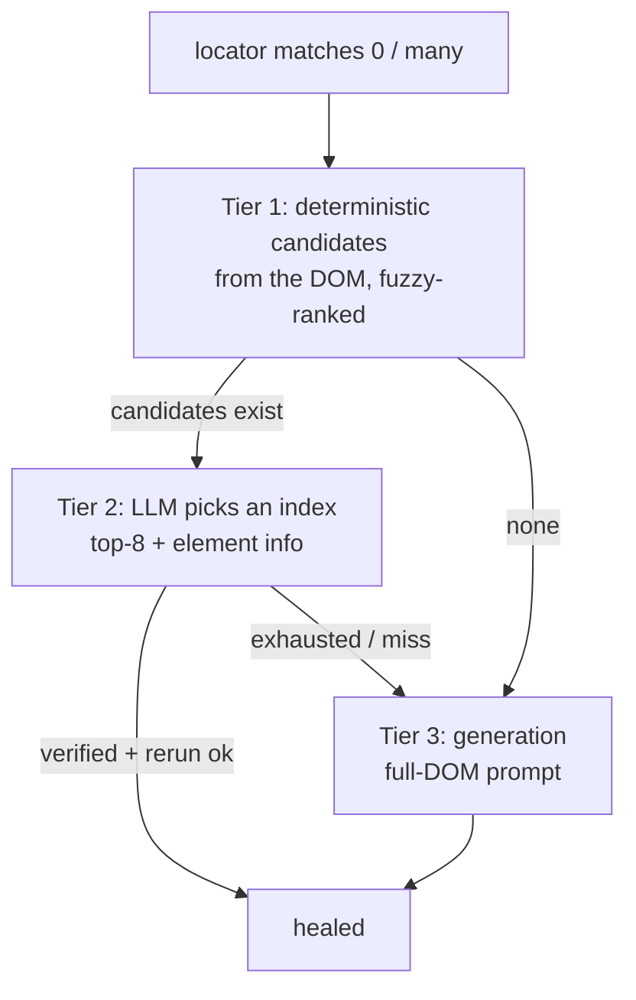

# Tiered locator healing

Locator drift is the most common failure, so its repair is a tiered ladder
(`HEAL_LOCATOR_TIERS`, default `selection`):

- **Tier 1** generates unique CSS candidates from the simplified DOM and ranks
  them by fuzzy similarity to the failed locator. Ranking *orders* candidates —
  it never decides, because a confident fuzzy match can still be the wrong field.
- **Tier 2** sends the ranked candidates with their tag/text/attributes and asks
  the model for an **index**. Picking an index is far easier than writing valid
  unique CSS — and the prompt is ~70% smaller.
- **Tier 3** falls back to the original full-DOM generation when the deterministic
  generator misses the intended element.

All three tiers feed the same live verification.

## Why selection is the default

Measured on 53 real recorded heals (per-call) and a 60-fixture corpus (full
pipeline), selection mode is cheaper everywhere and *more* accurate on small
models:

| Model | Generation acc | Selection acc | Prompt size |
|---|---|---|---|
| gpt-4.1-nano | 89% | **94%** | **−68%** |
| gemini-2.5-flash-lite | 89% | **94%** | −68% |
| llama-3.1-8b | 60% | **87%** | −68% |

The 8B model gains **+27 points** — picking from a verified shortlist rescues
models that can't reliably author selectors.

Full-pipeline corpus (60 fixtures, element-identity grading):

| Backend | Selection | Generation |
|---|---|---|
| gpt-4.1-nano | 92% @ 34k tok | 92% @ 111k tok |
| MiniMax-M2.5 | 93% @ 50k tok | 97% @ 141k tok |

Selection cuts tokens ~65–70% at equal accuracy on small models. A strong
reasoning model (MiniMax) extracts ~4 points more from the full DOM — so
accuracy-critical setups on capable models can opt into
`HEAL_LOCATOR_TIERS=generation`.

*Source: `experiments/selection-mode/FINDINGS.md`.*
