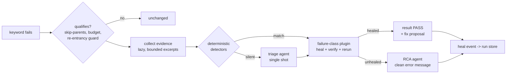

# Features

## Failure classes

Deterministic detectors run first (no LLM); a single-shot triage agent classifies only when detectors are silent:

| Class | Detection (deterministic) | Healing |
|---|---|---|
| `timing` | `document.readyState != complete` | wait until ready, rerun — no LLM |
| `overlay` | open `<dialog>` / permission popup while the target exists | click a verified dismiss control, verify gone, rerun |
| `viewport` | web: element exists outside the viewport · mobile: element absent from the current screen | scroll into view / bounded swipe search, rerun; on mobile falls through to locator healing when nothing is found |
| `assertion-drift` | RF assertion message patterns | opt-in: semantic-change guard, optional vision check, rerun with corrected expectation |
| `form-state` | required-but-empty / `aria-invalid` fields, `role=alert` messages | diagnose-only by default (names the fields the test never filled); auto-fill behind `HEAL_FORM_FILL` |
| `locator-drift` | locator matches 0 elements | locator agent proposes; every candidate is **live-verified** (exists, unique, visible) inside the agent loop; rerun with fallback through candidates |
| `unknown` | – | root-cause analysis only |

## The healing pipeline

The engine runs on a persistent background event loop; all Robot Framework
and browser/Appium calls are marshalled to the RF main thread. Per-failure
wall-clock and token budgets cap every transaction; breaching the run budget
degrades to RCA-only instead of failing the run.

## Capability-tiered model support

Small self-hosted models are first-class. The runtime resolves per-role
capabilities from backend presets (MiniMax `tool_choice` quirk, vLLM strict
schemas), explicit settings, or live probing (`heal doctor`):

- structured output: `tool` → `native` → `prompted` (the universal floor)
- verification always lives in output validators — it works in every mode
- exploration tools attach only on probed-reliable backends

## Root-cause analysis

Every transaction — healed, unhealed or suppressed — yields an `RcaRecord`:
clean message, root cause, suggested permanent fix, evidence references.
The test file's **git history** feeds the analysis ("this line last changed
14 months ago" → app-side change likely).

## Reports and fixes

- self-contained HTML dashboard (healed *and* unhealed, evidence, costs, hotspots)
- crash-safe JSONL run store, merged across `--rerunfailed`
- `summary.json` + GitHub annotations for CI gates
- SQLite healing history → repeat-healing hotspots
- fix engine over the RF AST: literal / variable / variable+suffix origins,
  imported `.resource` files, **blast radius** (a `shared` variable used at
  N call sites is never auto-applied), git-appliable `heal.patch`, opt-in
  in-place editing refused on dirty git trees

## Surfaces

One core, four surfaces:

- **RF listener** — realtime healing during execution
- **CLI** — `heal triage | report | apply | doctor | history | mcp`
- **MCP server** — failure bundles, fix proposals and `apply_fix` for coding agents
- **agent skill** — `skills/heal/SKILL.md` documents the triage→inspect→fix workflow
