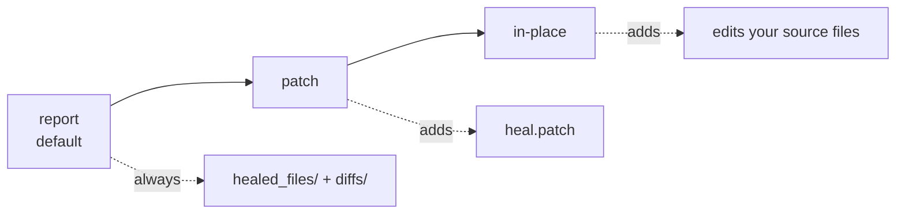

# Fix test files

Healing repairs a run; the **fix engine** turns that into a permanent change to
your `.robot`/`.resource` files. Every run with healed locators produces
read-only review artifacts — **your sources are never modified by default.**

## What you always get

- `healed_files/` — fixed copies of affected files
- `diffs/` — side-by-side HTML diffs with word-level highlighting, linked from
  the dashboard

## Tiers (`HEAL_FIX_TIER`)



| Tier | Adds | Safety |
|---|---|---|
| `report` (default) | healed copies + diffs | originals untouched |
| `patch` | `heal.patch` | `git apply heal.patch` when you choose |
| `in-place` | edits source files at end of run | refused on a dirty git tree; **`shared` blast radius never auto-applied** |

## Where the fix lands

The engine resolves the locator's origin through the RF parsing model:

| Origin | Fix target |
|---|---|
| literal argument | that call site |
| `${VAR}` / `css=${VAR} li` | the variable definition (incl. imported `.resource`) |
| locator passed into a shared user keyword | the **call site(s)** passing it — never the keyword body |
| Python/YAML variable files, multi-hop chains | reported as *unresolved* |

A variable used at many sites is classified **`shared`** and is never auto-applied
in place — you review the patch and decide. See
[blast radius](../explanation/rca-and-fixes.md#fix-blast-radius).

## Apply later from the CLI

```bash
heal apply results/ --patch fixes.patch   # write a patch
heal apply results/ --in-place            # edit sources (clean tree required)
```
