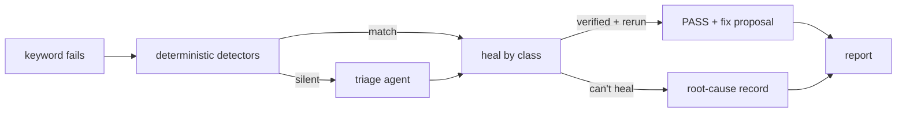

# Robot Framework Heal

**Failure triage, self-healing and root-cause analysis for Robot Framework UI tests** —
Browser/Playwright, SeleniumLibrary and Appium.

Every failed keyword is classified into a [failure class](reference/failure-classes.md),
healed when possible, and **always** turned into a clean, enriched error record with
evidence, the healing attempts, and a suggested permanent fix.

[Get started in 5 minutes :material-arrow-right:](tutorials/getting-started.md){ .md-button .md-button--primary }
[What you get :material-arrow-right:](what-you-get.md){ .md-button }

---

## Why heal

- **Heals more than locators** — timing, viewport, overlays, missing form fields,
  assertion drift, and locator drift, each with its own strategy.
- **Verified, never guessed** — every proposed fix is checked against the live page
  before the keyword reruns.
- **Runs on any model** — any OpenAI-compatible endpoint (vLLM, Ollama, LiteLLM,
  MiniMax, OpenRouter) or a pydantic-ai provider string. Capability is
  [probed, not assumed](explanation/model-tiers.md); small models work via a
  prompted-JSON floor.
- **Never edits your suite by surprise** — fixes are read-only copies + diffs by
  default; applying them to source is opt-in and [blast-radius aware](explanation/rca-and-fixes.md#fix-blast-radius).
- **Explains every failure** — even unhealable ones get a root-cause record.

## Quickstart

```robotframework
*** Settings ***
Library    Browser    timeout=3s
Library    heal.rf.HealListener
```

```bash
# .env (auto-loaded)
HEAL_MODEL=openai/gpt-4.1-nano
HEAL_BASE_URL=https://openrouter.ai/api/v1
HEAL_API_KEY=sk-...
```

```bash
heal doctor --role locator   # verify the endpoint
robot -d results suites/     # heal during the run
```

See the [getting-started tutorial](tutorials/getting-started.md) for the full walkthrough.

## How it heals



## Documentation map

- **[Tutorials](tutorials/getting-started.md)** — learn by doing
- **[How-to guides](how-to/model-providers.md)** — provider setups, Selenium/Appium, CI, fixing files, MCP
- **[Reference](reference/configuration.md)** — every `HEAL_*` setting, the CLI, failure classes, drivers
- **[Explanation](explanation/failure-taxonomy.md)** — the design and the benchmarks behind it
