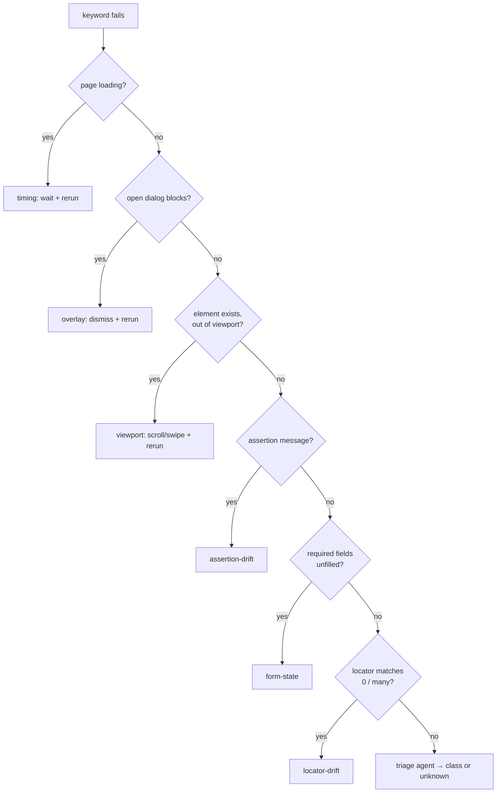

# Failure classes

Every failed keyword is classified into exactly one failure class. Deterministic
detectors run first (no LLM); a single-shot triage agent classifies only when no
detector matches. Each class has its own healing strategy and opt-in flags.

| Class | Detected when | Healing action | LLM? | Opt-in |
|---|---|---|---|---|
| `timing` | `document.readyState != complete` | wait for ready, rerun | no | — |
| `overlay` | an open `<dialog>`/banner intercepts, target still present | dismiss a verified control, rerun | no¹ | — |
| `viewport` | element exists but outside the viewport (web) / absent from the current screen (mobile) | scroll / bounded swipe into view, rerun | no | — |
| `assertion-drift` | RF assertion message `Text 'x' should be 'y'` | verify drift, rerun with corrected expectation | yes (vision optional) | `HEAL_HEAL_ASSERTIONS` |
| `form-state` | required-but-empty / `aria-invalid` fields on a blocked submit | diagnose the fields; optionally fill | DOM + optional vision | `HEAL_FORM_FILL` (fill) |
| `locator-drift` | locator matches 0 elements (or is ambiguous) | propose → verify → rerun (tiered) | yes | — |
| `unknown` | nothing else matches | root-cause analysis only | triage only | — |

¹ The dismiss control is chosen by deterministic heuristics; an LLM is used only to pick among already-verified candidate controls.

## Detection order

The order is deliberate — a loading page explains everything, a blocking dialog
beats out-of-viewport (both need the element present), and the mobile viewport
branch runs before locator-drift and falls through to it when swiping finds nothing.

## Always-on output

Healed, unhealed, or suppressed — every transaction produces a typed
[root-cause record](../explanation/rca-and-fixes.md) and a
[report event](reports.md). Healing is never the only product: the enriched
error for an *unhealable* failure is half the value.

See [Failure taxonomy and triage](../explanation/failure-taxonomy.md) for the
reasoning behind this design, and [Tiered locator healing](../explanation/tiered-locators.md)
for how `locator-drift` is repaired.
