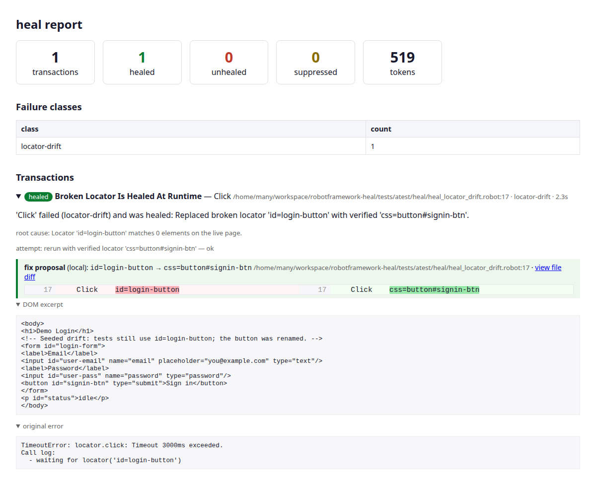
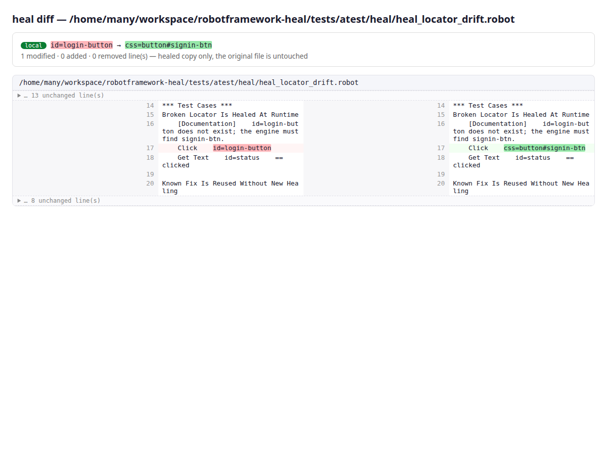

# What you get

After a run, heal writes a self-contained report. Here is what it looks like on a
single healed locator.

## The dashboard

A drill-down for every transaction: the healed badge, a clean root-cause message,
the attempts, and a **fix proposal with a word-highlighted inline diff** of the
suggested permanent change — plus the DOM excerpt and original error.



## Side-by-side diffs

Each healed file gets a full side-by-side diff page (linked from the dashboard).
Your original files are never modified — these are read-only copies under
`healed_files/`.



## heal doctor

Before a run, `heal doctor` probes each configured endpoint and resolves its
capabilities — so you know exactly which output mode and features heal will use:

```text
resolved configuration:
  locator  model=openai/gpt-4.1-nano base_url=https://openrouter.ai/api/v1 api_key=sk-***… output_mode=auto
  budgets  max_failure_seconds=60.0 max_run_tokens=2000000 fix_tier=report

probing locator -> openai/gpt-4.1-nano ...
  tool_output        PASS   2.2s
  native_output      PASS   0.9s
  prompted_output    PASS   1.9s
  exploration_tool   PASS   2.7s
  resolved: output=tool tools=reliable vision=False
```

## Everything else

`events.jsonl` (crash-safe run store), `summary.json` (CI gates), `heal.patch`
(at `HEAL_FIX_TIER=patch`), and `history.sqlite` (cross-run memory). See the
[report-artifacts reference](reference/reports.md).
